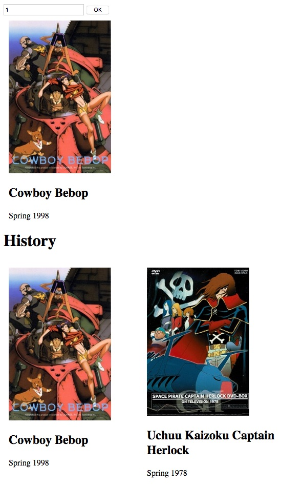
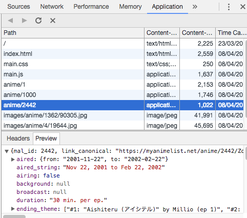

- [Build a PWA from scratch](#build-a-pwa-from-scratch)
    - [Introduction](#introduction)
    - [Requirements](#requirements)
    - [Project description and initialization](#project-description-and-initialization)
    - [The app shell](#the-app-shell)
    - [The PWA manifest](#the-pwa-manifest)
    - [Adding a Service Worker](#adding-a-service-worker)
    - [Caching the history](#caching-the-history)
    - [Conclusion and going further](#conclusion-and-going-further)
    - [Links](#links)

# Build a PWA from scratch

Welcome to my guide for creating a PWA (progressive web app) from scratch. I hope that it will help understand a little more about service workers, manifest and caching. Enjoy :mortar_board:.

## Introduction

This guide will help build a very simple PWA from scratch, with the intent of showing you only the wpa related code. Thus, no frameworks or code generators will be used. The HTML and CSS content will be very minimal. This will allow to focus only on the parts that are PWA related.
We are going to practice the following features:

- Add shortcut to home-screen
- Splash-screen (kind of :blush: )
- Service Worker
- Caching

Before getting into the code, let’s prepare our workstation with the necessary elements.

## Requirements

We are going to use Visual Studio Code IDE, and use these languages: HTML 5, CSS3 and EcmaScript 6. Here is the setup that I recommend for this tutorial:

- Visual studio code which will be our IDE
- The following VSCode extensions
  - [Live server](https://marketplace.visualstudio.com/items?itemName=ritwickdey.LiveServer): it allows to run the current workspace on a local server with a single button click
  - Optionally, [JavaScript Snippet Pack](https://marketplace.visualstudio.com/items?itemName=akamud.vscode-javascript-snippet-pack) or any other extension that helps you working on web projects.
- A JSON API that you can easily call for the sake of simplicity. There is a GitHub that categorizes some [public APIs](https://github.com/toddmotto/public-apis). In this guide, we are going to use [Jikan API](https://jikan.docs.apiary.io/#reference)
- Latest version of Chrome or Firefox

Once everything is setup and ready, we can initialize the first lines of code.

## Project description and initialization

The PWA that we are going to build is a simple anime search app. It allows to display an anime given its **id**. Thus, it will show and input field and buttons for entering an anime id and validating it. In addition, we will display the search history of the user. The first step consists in adding a manifest that allows to add the PWA to home-screen. Next, a service worker will be added to cache the previous search actions and thus will not fail even in offline mode. To demonstrate the use of caching without service workers, the search history will be cached for offline use.



We are going to create the first files and first lines of code of our project. This allows to have some code running and also test our setup before digging into PWA concepts.

Please follow the below steps to get a minimal html website:

- Create an empty folder that will contain our project
- Launch VSCode and open that folder
- Create a new HTML file
- Initialize the file with an HTML snippet (CTRL+SHIFT+P -> type snippet -> choose html)
- Add a **main.js** file and **main.css file** which we will use later

The html file should be similar to this one:

```html
<!DOCTYPE html>
<html>
<head>
    <meta charset="utf-8" />
    <meta http-equiv="X-UA-Compatible" content="IE=edge">
    <title>Page Title</title>
    <meta name="viewport" content="width=device-width, initial-scale=1">
    <link rel="stylesheet" type="text/css" media="screen" href="main.css" />
    <script src="main.js"></script>
</head>
<body>
</body>
</html>
```

Let's test the [Live server](https://marketplace.visualstudio.com/items?itemName=ritwickdey.LiveServer) extension by right clicking somewhere on the **Go Live** button on the toolbar. You default browser should render your **index.html** as a blank page.

The serious stuff starts nows :v: with the app shell goodness.

## The app shell

The app shell is defined by [Addy Osmani](https://developers.google.com/web/fundamentals/architecture/app-shell) as:

> The minimal HTML, CSS and JavaScript required to power the user interface and when cached offline can ensure instant, reliably good performance to users on repeat visits

Here, I try to give a synthetic definition (se excuse me if I'm wrong :smiley: ):

> The app "shell" is the HTML, CSS and JS and media content of a PWA that is:
> - Sufficient for browsing online or offline
> - Minimal
> - Constant

Let me explain these points:

- Sufficient for browsing online or offline: the app shell should be designed in a such a that users can browser all of the content of the website whether online or offline
- Minimal: the app shell is the content that is first loaded when we open a PWA. having a small and optimized app shell means faster load time and smaller caching.
- Constant: since we are going to use the PWA offline, we need to cache some html, css, js and media files to load the app. Having a base content that changes over time makes managing offline mode very complicated. Thus, I consider a good app shell to be constant.

In light of that explanation, the app shell will have a single HTML page with no anime content at all. The anime content will be loaded from the internet or from the cache. The shell will also contain the javascript code that allows to look for anime and maintain a search history. Finally we will add a css file and the static assets to the app Shell.

This app shell will be very small, constant or static and allow us to use all the functions the PWA whether offline or online.

Let's go back to VSCode and these content to the page:

- A button and an input field
- Two empty divs. One for displaying the result of the searched anime (with `id="main_anime"`) and another one for showing the history (with `id="history"`).

The html file should look like this now and it should not change.

```html
<!DOCTYPE html>
<html>

<head>
    <meta charset="utf-8" />
    <meta http-equiv="X-UA-Compatible" content="IE=edge">
    <title>Page Title</title>
    <meta name="viewport" content="width=device-width, initial-scale=1">
    <link rel="stylesheet" type="text/css" media="screen" href="main.css" />
    <script src="main.js"></script>
</head>

<body>
    <div>
        <input id="anime_id_input" placeholder="Anime id" />
        <button id="ok_button" onclick="onOkButtonClickAsync()">OK</button>
    </div>
    <div id="main_anime">
    </div>
    <h1>History</h1>
    <div id="history">

    </div>
</body>

</html>
```

Let's also add some css

```css
#history {
    display: flex;
    flex-direction: row;
    flex-wrap: wrap;
}

.anime_item {
    margin: 10px;
    width: 250px;
}

.anime_item img {
    width: 80%;
    height: auto;
    /* allows to adapt to browser width */
    overflow: hidden;
}
```

The javascript part of our app shell will be evolving throughout the tutorial. But for now let's do the basic things.

First of all, define the constants and the functions that will generate the anime tags from a single anime object.

```javascript
//create an empty array on startup
let animes = Array()
const API_BASE = "https://api.jikan.me/"
const API_ANIME = API_BASE + "anime/"

/**
 * generate anime tag from a Javascript Object that containt the anime information
 */
function buildAnimeMarkup(anime) {
    return `<div class="anime_item">
        <h2 class='anime_name'>${anime.title}</h2>
        <p class='anime_description'>${anime.premiered}</p></div>`
}
```

The `animes` array allows to store the history of searched anime.

You can see here an example of an anime object <https://api.jikan.me/anime/1000>. You can change the at the end to see a different anime.

Here is the code that loads an anime and updates the history when the user clicks on the button:

```javascript
/**
 * add an anime to the history and updates display
 */
function updateHistory(anime) {
    animeHistory.push(anime)
    //update display
    addAnimeToHistoryTag(anime)
}

/**
 * Update the DOM
 */
function addAnimeToHistoryTag(anime) {
    document.querySelector('#history').innerHTML = buildAnimeMarkup(anime) + document.querySelector('#history').innerHTML
}

/**
 * loadAnAnime from the internet and place it on a target element
 */
async function onOkButtonClickAsync() {
    let targetElementId = '#main_anime'
    let animeId = document.querySelector("#anime_id_input").value
    try {
        const response = await fetch(API_ANIME + animeId)
        if (!response.ok) {
            return
        }
        let anime = await response.json()
        console.log("anime", anime)
        document.querySelector(targetElementId).innerHTML = buildAnimeMarkup(anime)

        updateHistory(anime)
    } catch (err) {
        console.error(`error ${err}`)
    }
}
```

In this code we use the `fetch` API to load content from the server and then display it on the main div and the history div.

As you can see there no manifest, service worker, not cache. It is OK because the app shell is not finalized.

You can test the app right now. It is not yet PWA compliant but we will work on it in the next steps :smirk:.

## The PWA manifest

Our first step in the PWA world is adding a manifest file. Here is its definition from [MDN](https://developer.mozilla.org/en-US/docs/Web/Manifest):

> The web app manifest provides information about an application (such as name, author, icon, and description) in a JSON text file.

Adding a web manifest gives you other advantages. Here are some of them:

- They allow the user to add a bookmark on your home-screen or desktop
- It allows to display a simple splash-screen while the app is loaded

Since the web manifest is a plain JSON file, we can either write it manually or use a tool to generate it. We are going to use this [Web App Manifest Generator](https://tomitm.github.io/appmanifest/).


Using the tool, try to generate the following `JSON` file or a similar one.

```json
{
    "name": "PWA from scratch",
    "short_name": "PWA from 0",
    "lang": "fr",
    "start_url": "/",
    "display": "fullscreen",
    "theme_color": "#c2f442",
    "icons": [{
            "src": "pwa0-64.png",
            "sizes": "64x64"
        },
        {
            "src": "pwa0-128.png",
            "sizes": "128x128"
        },
        {
            "src": "pwa0-512.png",
            "sizes": "512x512"
        }
    ]
}
```

Put that JSON in a file called `manifest.json` and place it in the root of your website.

We will also update the HTML head with the html generated by the tool.

```html
<link rel="manifest" href="manifest.json">

<meta name="mobile-web-app-capable" content="yes">
<meta name="apple-mobile-web-app-capable" content="yes">
<meta name="application-name" content="PWA from scratch">
<meta name="apple-mobile-web-app-title" content="PWA from scratch">
<meta name="msapplication-starturl" content="/index.html">
<meta name="viewport" content="width=device-width, initial-scale=1, shrink-to-fit=no">
```

Let's try to open the app on one of your mobile phones browser. After opening the url `MACHINE_IP:PORT`, tap the menu button of your browser and look for the option **Add to home screen**


By choosing this option, you will end up with a link of you PWA on your home screen.


Next, open tap on the shortcut. you will see a small loading screen. If your look at the manifest, you can see the effect of entries `theme_color` and `icons`. They allow to customize the loading screen of the PWA.


Right after that, the fullscreen PWA is shown with all its glory thanks to the `"display": "fullscreen"` option in the manifest.


Yaaaay ! The PWA is now added to my home-screen :heart_eyes:. However, there is no caching right now :unamused:. Let's deal with that next :rocket:.

## Adding a Service Worker

In this section, we are going to implement an offline cache for the static files and the responses of the fetch requests that load anime info from Jikan.

In order to cache responses to requests made by the browser, we need to implement a proxy that intercepts those requests. In other words we will customize the behavior `fetch` calls by caching the response and presenting the cached content. The **proxy** that allows us to do that is called a **Service Worker**. The API that allows us to cache request and response objects is the [**Cache API**](https://developer.mozilla.org/fr/docs/Web/API/Cache).

The service worker is basically a set of event handlers for some browser events that must be implemented in a separate file, often called **sw.js**. In order to use it, we need to register it to the browser. In order to do that, add the following function to the **main.js** file and add it to the `onload` event handler of your **index.html** page.

```javascript
/**
 * Install the service worker
 */
async function installServiceWorkerAsync() {
    if ('serviceWorker' in navigator) {
        try {
            let serviceWorker = await navigator.serviceWorker.register('/sw.js')
            console.log(`Service worker registered ${serviceWorker}`)
        } catch (err) {
            console.error(`Failed to register service worker: ${err}`)
        }
    }
}
```

When the page reloads, you should see the following log line in the console of your browser.

> Service worker registered [object ServiceWorkerRegistration]

Which means that the file **sw.js** in `let serviceWorker = await navigator.serviceWorker.register('/sw.js')` has been successfully registered as a service worker. You can confirm that by checking the **Applications** tab of the Chrome developer tools.


The application tab is a very useful tool for debugging your PWA. I invite you to play with its different menus.

When developing a service worker, it is recommended to check the **Update on reload** checkbox. It makes chrome reinstall the Service Worker after each registration. Otherwise, when you register a new service worker, you will o manually unregister the previous one for the new one to be used. So, please go ahead and check it.

Next, create a javascript file at the root folder called **sw.js** (or whatever you specified to the register method). As written above, the service worker is a set of event handlers that allow us to mainly provide caching behavior (or whatever we want). We are going to implement two event handlers: **install**  and **fetch**.

The first event is `install`. It is called once after a successful service worker **registration**. It is the best place to cache the app shell and all static content. We are going to use Cache API of the service worker to add those files as follows. Add the following code to sw.js.

```javascript
const CACHE_NAME = "V1"

/**
 * The install event is fired when the registration succeeds.
 * After the install step, the browser tries to activate the service worker.
 * Generally, we cache static resources that allow the website to run offline
 */
this.addEventListener('install', async function() {
    const cache = await caches.open(CACHE_NAME);
    cache.addAll([
        '/index.html',
        '/main.css',
        '/main.js',
    ])
})
```

Using the cache is pretty straightforward; we first `open` it and then `addAll` static files.

You can check that the files successfully added by clicking on the **Cache Storage** on the left menu.


Great, the files that I added earlier are all inside the cache storage. However, we just did half of the caching. In order to confirm that, click on the **offline** checkbox in the service worker menu. Refresh the page and ... :scream: the web app fails to load. To sum up, we added file to the cache but they were not loaded in offline mode. The problem is that we did not inform the browser to use them when the network call fails.

The remaining piece of the puzzle id the `fetch` event of the service worker. This event is called before any network request is emitted by the browser. When we handle this event, we can choose to load cached content, forge our response object or just get the network response. And as a bonus the `fetch` event handler that we are going to implement will also cache the API calls.

Please add to following to the service worker.

```javascript
/**
 * The fetch event is fired every time the browser sends a request. 
 * In this case, the service worker acts as a proxy. We can for example return the cached
 * version of the ressource matching the request, or send the request to the internet
 * , we can even make our own response from scratch !
 * Here, we are going to use cache first strategy
 */
self.addEventListener('fetch', event => {
    //We defind the promise (the async code block) that return either the cached response or the network one
    //It should return a response object
    const getCustomResponsePromise = async => {
        console.log(`URL ${event.request.url}`, `location origin ${location}`)

        try {
            //Try to get the cached response
            const cachedResponse = await caches.match(event.request)
            if (cachedResponse) {
                //Return the cached response if present
                console.log(`Cached response ${cachedResponse}`)
                return cachedResponse
            }

            //Get the network response if no cached response is present
            const netResponse = await fetch(event.request)
            console.log(`adding net response to cache`)

            //Here, we add the network response to the cache
            let cache = await caches.open(CACHE_NAME)

            //We must provide a clone of the response here
            cache.put(event.request, netResponse.clone())

            //return the network response
            return netResponse
        } catch (err) {
            console.error(`Error ${err}`)
            throw err
        }
    }

    //In order to override the default fetch behavior, we must provide the result of our custom behavoir to the
    //event.respondWith method
    event.respondWith(getCustomResponsePromise())
})
```

Please note that the main line of code is this one `event.respondWith(getCustomResponsePromise())`. It allows us to **override** the browser response with a `Promise` or `async` function that resolves to a `Response` instance.

Basically, this event handler loads content from the Cache Storage. If the content is not available, we get it from the internet. This behavior is called a **Cache first strategy**. Other strategies are available and you even make your own **fetch cats :smiley_cat:** strategy.

Reload the page, do some anime searches and verify the cache storage. New elements should pop there.



Next, check the **offline** checkbox and try opening the page again. Magnificent ! The page is loaded and we can even search for previously searched anime. It event works on my phone using plane mode. It's magic :heart_eyes:.

After harnessing all that power, there is still a last thing to do which is caching the history. Since it is an array that we build and not a direct network response, we cannot use the Cache API and the service worker. The next part of this guide will show a way for caching outside of service workers.

## Caching the history

In this section we are going to cache the `animeHhistory` array using the `localStorage` object. It allows to store data and retrieve when the page is reloaded **even after closing the browsing windows**. Storing an entry is performed using `localStorage.setItem(key, entry)` and retrieving it is performed using `localStorage.getItem(key)`.

The caveat here is that this persistent storage however works only with string values. So, we need to serialize/deserialize our array to/from a JSON string when storing/loading respectively. This is achieved thanks to `JSON.stringify(array)` and `JSON.parse(string)` functions.

In **main.js** modify the `updateHistory` function as follows.

```javascript
const HISTORY_STORAGE_KEY = 'HISTORY_KEY'
/**
 * add an anime to the history and updates display
 */
function updateHistory(anime) {
    animeHistory.push(anime)
    //Save the array in the local storage
    localStorage.setItem(HISTORY_STORAGE_KEY, JSON.stringify(animeHistory))
    //update display
    addAnimeToHistoryTag(anime)
}
```

Finally, we need to load the history from the storage on page load. Modify the `onLoadAsync` function as follows.

```javascript
/**
 * The history is serrialized as a JSON array. We use JSON.parse to convert is to a Javascript array
 */
function getLocalHistory() {
    return JSON.parse(localStorage.getItem(HISTORY_STORAGE_KEY))
}

async function onLoadAsync() {
    //load the history from cache
    let history = getLocalHistory()
    if (history !== null) {
        //set the animeHistory array and update the display
        animeHistory = history
        animeHistory.forEach(anime => addAnimeToHistoryTag(anime))
    }

    //Install the service worker
    if ('serviceWorker' in navigator) {
        try {
            let serviceWorker = await navigator.serviceWorker.register('/sw.js')
            console.log(`Service worker registered ${serviceWorker}`)
        } catch (err) {
            console.error(`Failed to register service worker: ${err}`)
        }
    }
}
```

Don't panic, we just added a function that loads the anime history from the local storage and then we called it in the `onLoadAsync`function since we want to update the DOM with the history as soon as it is available.


Voilà, our small PWA shows the history when the page is loaded and is updated over time :fireworks:.

## Conclusion and going further

TODO

## Links

- [Adding a Service Worker and Offline into your Web App](https://developers.google.com/web/fundamentals/codelabs/offline/)
- [The App Shell Model](https://developers.google.com/web/fundamentals/architecture/app-shell)
- [Progressive Web App tutorial – learn to build a PWA from scratch](https://www.youtube.com/watch?v=gcx-3qi7t7c)
- [Manifeste des applications web](https://developer.mozilla.org/fr/docs/Web/Manifest)
- [The Web App Manifest](https://developers.google.com/web/fundamentals/web-app-manifest/)
- [HTML5 Web Storage](https://www.w3schools.com/html/html5_webstorage.asp)
- [How do I store an array in localStorage?](https://stackoverflow.com/questions/3357553/how-do-i-store-an-array-in-localstorage?utm_medium=organic&utm_source=google_rich_qa&utm_campaign=google_rich_qa)
